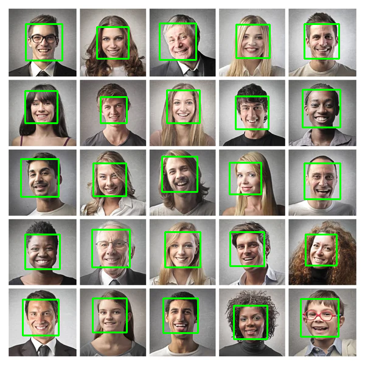
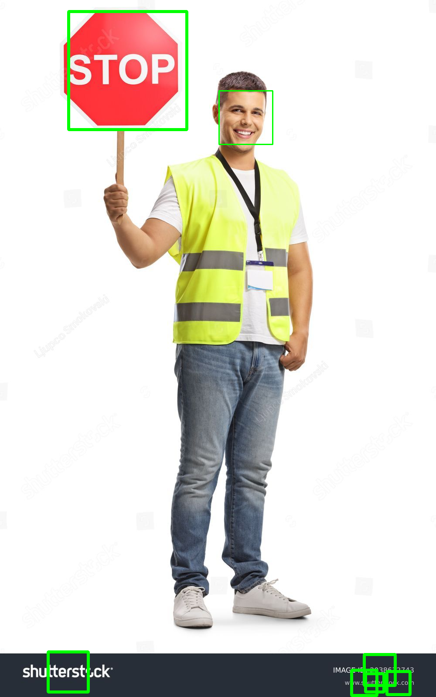

## Image detection using openCV models

## Overview
This project entails:
1. Using OpenCV models to detect objects.
2. Integrating GitHub Actions for Continuous Integration/Continuous Deployment (CI/CD) process.
3. Labeling detected objects.

## Installation Steps

1. Install the system level packages:
sudo apt-get install -y libgtk2.0-dev pkg-config
2. Install the Python package dependencies:
pip install -r requirements.txt

## Run the code
1- cd to related folder you cloned and run python
`python3 "src/classification-face-stop-sign-recognition.py"`

## Results

## Before:

## After:

